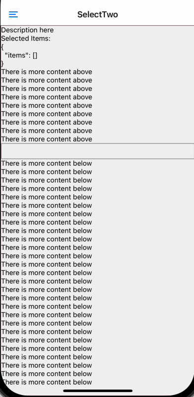

## Select 2 para web y móvil

Componente para mostrar la selección de la parte N de una relación




En móvil es un [bottom sheet](https://gorhom.github.io/react-native-bottom-sheet/) (pensado para mostrar un listado de elementos), en web se usa [react select](https://react-select.com/home). Soporta multiselección.

## Uso
```typescript jsx
<CustomSelectTwoNative<People>
    isMultiple={isMultiple}
    clearValues={clearValues}
    data={data?.results || []}
    onChange={onChange}
    selectedItems={selectedItems}
    searchValue={search}
    onSearchTextChange={v => setSearch(v)}
    isDataLoading={isLoading}
    getOptionLabel={item => item.name}
    getOptionValue={item => item.url}
    helpText="Selecciona clientes"
    onInputChange={console.log}
/>
```

## Notas

Si se va a poner contenido después del componente (que es lo normal) y el contenido de la vista se superpone al del bottom tab en móvil, poner ```<BottomSheetModalProvider>``` en la vista o en el raiz de la app a modo provider.